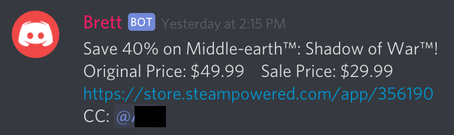

# Brett
A nifty Discord bot

## Features
* Scrapes users' steam wishlists for deals.


## Usage
To start, you'll need a config file. It can be placed anywhere, but the default is `brett-config.json` in the root of the directory.

A config file is made up of a token, and sub objects for modules. See example below
```json
{
  "token": "DISCORD BOT TOKEN"
}
```

Then, run `node bin/main.js`

### Wishlist
Brett can check users' wishlists for sales on both Steam and Humble Bundle

For the wishlist functionality, you'll need to add to your config. You need a cache (a sqlite3 database to store sales and user data), a channel ID to post in, a channel ID to recieve commands in (can be the same channel), and how far back to scan for messages. See example below
```json
{
  "cache": "$HERE/brett-data.db",
  "token": "DISCORD BOT TOKEN",
  "messages": {
      "channel": "MESSAGE CHANNEL NUMBER",
      "hours": 2
    },
  "wishlist": {
    "channel": "ALERTS CHANNEL NUMBER"
    }
}
```

In the cache file path, $HERE will be replaced with the directory of `brett-config.json`

To activate the wishlist functionality, use the `-w` flag.

Brett will then post in the specified channel about any sales for any games on a user's steam wishlist and mention them.
(It will mention multiple users that have the same game, not make an individual post.)

The bot will not post about a game until the next time it goes on sale. (So the game must go off sale, then back on sale)

### Chat

Brett now supports chat and reads commands in a specified channel. The following is the current help text.

Hi! The following commands are supported! Use these at the beginning of your message

* !add: Signs you up for wishlist service. Brett will alert you when your steam wishlist games go on sale. Your steam profile MUST be public! Pass your Steam Community ID as an argument. If you don't know what your Steam Community ID is, it's the number that comes after `http://steamcommunity.com/profiles/`.

Example: `!add STEAMCOMMUNITYID`

* !remove: Removes you from the wishlist service. Not much more to add here

Example: `!remove`

* !mysteamid: DMs you your Steam Community ID if you are signed up.

Example: `!steamid`

* !help: Brings up this menu

Example: `!help`


## Installation
`npm install && tsc`

## Contributing
Feel free to submit a PR or make suggestions! I'd appreciate it!
